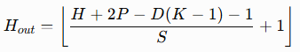
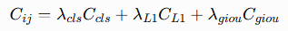
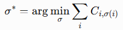

我建议做成  **24 课、6 个阶段的一套 DEIMv2 源码课程** 。这样既能照顾视觉算法初学者，又能把你最关心的 `deim_dfine_x`、`deimv2_dinov3_x` 和 DEIM/DEIMv2 训练优化真正拆透。

我已经按当前官方 [DEIMv2 GitHub 仓库](https://github.com/Intellindust-AI-Lab/DEIMv2?utm_source=chatgpt.com)、[DEIMv2 论文](https://arxiv.org/abs/2509.20787?utm_source=chatgpt.com) 和原始 [DEIM 论文](https://arxiv.org/abs/2412.04234?utm_source=chatgpt.com) 重新核对。当前仓库顶层主要是 `configs/`、`engine/`、`tools/`、`train.py` 等；官方模型覆盖 Atto→X 八档，其中 S/M/L/X 是 ViT/DINOv3 路线，轻量型号则包含 HGNetv2 路线。

而且你指定的两个模型非常适合做课程的两条主线：

<pre class="overflow-visible! px-0!" data-start="457" data-end="812"><div class="relative w-full mt-4 mb-1"><div class=""><div class="contents"><div class="relative"><div class="h-full min-h-0 min-w-0"><div class="h-full min-h-0 min-w-0"><div class="border border-token-border-light border-radius-3xl corner-superellipse/1.1 rounded-3xl"><div class="h-full w-full border-radius-3xl bg-(--code-block-surface) corner-superellipse/1.1 overflow-clip rounded-3xl [--code-block-surface:var(--bg-elevated-secondary)] dark:[--code-block-surface:var(--composer-surface-primary)] lxnfua_clipPathFallback"><div class="pointer-events-none absolute end-1.5 top-1 z-2 md:end-2 md:top-1"></div><div class="relative"><div class="pe-11 pt-3"><div class="relative z-0 flex max-w-full"><div id="code-block-viewer" dir="ltr" class="q9tKkq_viewer cm-editor z-10 light:cm-light dark:cm-light flex h-full w-full flex-col items-stretch ͼd ͼr"><div class="cm-scroller"><pre class="cm-content q9tKkq_readonly m-0"><code><span>主线 A：deim_dfine_x
Image
  ↓
HGNetv2
  ↓
multi-scale features
  ↓
HybridEncoder
  ↓
DFINETransformer
  ↓
D-FINE box representation / refinement
  ↓
DEIM training framework
  ↓
boxes + classes

主线 B：deimv2_dinov3_x
Image
  ↓
DINOv3 ViT-S+
  ↓
STA
  ↓
1/8, 1/16, 1/32 multi-scale features
  ↓
HybridEncoder
  ↓
DEIMTransformer
  ↓
boxes + classes</span></code></pre></div></div></div></div></div></div></div></div></div><div class=""><div class=""></div></div></div></div></div></div></pre>

第二条正是 DEIMv2 的核心升级路线。官方 X 配置使用 `dinov3_vits16plus`、`interaction_indexes=[5,8,11]`、256 hidden dimension、6 decoder layers，并使用三层 `[256,256,256]` 特征。

---

# DEIMv2 从零到源码：24 课完整课程

每一课以后都固定采用同一套学习方式：

**直觉 → 数学 → 网络结构图 → 官方源码 → 逐行解释 → Tensor shape → PyTorch 最小实验 → 回到 DEIMv2 → 本课练习。**

也就是说，我们不会出现“知道 attention 是什么，但打开源码还是看不懂”的情况。


## 第一阶段：先获得读懂 DEIMv2 所需的全部基础

### 第 1 课：从一张图片到目标检测——先建立整套地图

这是零基础真正的第一课。

先不碰复杂 Transformer，而是回答最重要的问题：

```
[B, 3, 640, 640]
        ↓
     Backbone
        ↓
feature maps
        ↓
     Encoder
        ↓
multi-scale features
        ↓
     Decoder
        ↓
300 object queries
        ↓
class + bbox
        ↓
最终检测结果
```


会学习 image、pixel、channel、feature map、stride、receptive field、bounding box、classification、localization、backbone/neck/head/encoder/decoder 分别是什么意思。

第一次进入真实入口：

```
# train.py
cfg = YAMLConfig(...)
solver = TASKS[cfg.yaml_cfg['task']](cfg)
solver.fit()
```

然后追踪到 DEIM：

```
x = self.backbone(x)
x = self.encoder(x)
x = self.decoder(x, targets)
```


官方 DEIM 的模型容器本身实际上非常简单，真正的复杂度藏在三个模块里面。

 **实验：** 自己写一个 20 行的 TinyDetector，并用 hook 打印每一层 shape。


### 第 2 课：PyTorch 与 Tensor——以后所有 shape 推导的基础

这一课专门解决源码阅读最大的障碍：

<pre class="overflow-visible! px-0!" data-start="2072" data-end="2191"><div class="relative w-full mt-4 mb-1"><div class=""><div class="contents"><div class="relative"><div class="h-full min-h-0 min-w-0"><div class="h-full min-h-0 min-w-0"><div class="border border-token-border-light border-radius-3xl corner-superellipse/1.1 rounded-3xl"><div class="h-full w-full border-radius-3xl bg-(--code-block-surface) corner-superellipse/1.1 overflow-clip rounded-3xl [--code-block-surface:var(--bg-elevated-secondary)] dark:[--code-block-surface:var(--composer-surface-primary)] lxnfua_clipPathFallback"><div class="pointer-events-none absolute end-1.5 top-1 z-2 md:end-2 md:top-1"></div><div class="relative"><div class="pe-11 pt-3"><div class="relative z-0 flex max-w-full"><div id="code-block-viewer" dir="ltr" class="q9tKkq_viewer cm-editor z-10 light:cm-light dark:cm-light flex h-full w-full flex-col items-stretch ͼd ͼr"><div class="cm-scroller"><pre class="cm-content q9tKkq_readonly m-0"><code><span>B = batch
C = channel
H,W = spatial resolution
N = query/token 数量
D = embedding dimension
L = feature level</span></code></pre></div></div></div></div></div></div></div></div></div><div class=""><div class=""></div></div></div></div></div></div></pre>

学习：

<pre class="overflow-visible! px-0!" data-start="2198" data-end="2290"><div class="relative w-full mt-4 mb-1"><div class=""><div class="contents"><div class="border border-token-border-light border-radius-3xl corner-superellipse/1.1 rounded-3xl"><div class="relative h-full w-full border-radius-3xl bg-(--code-block-surface) corner-superellipse/1.1 overflow-clip rounded-3xl [--code-block-surface:var(--bg-elevated-secondary)] dark:[--code-block-surface:var(--composer-surface-primary)] lxnfua_clipPathFallback"><div class="pointer-events-none absolute inset-x-4 top-12 bottom-4"><div class="pointer-events-none sticky z-40 shrink-0 z-1!"><div class="sticky bg-token-border-light"></div></div></div><div class="relative"><div class="h-full min-h-0 min-w-0"><div class="h-full min-h-0 min-w-0"><div class=""><div class="relative"><div class=""><div class="relative z-0 flex max-w-full"><div id="code-block-viewer" dir="ltr" class="q9tKkq_viewer cm-editor z-10 light:cm-light dark:cm-light flex h-full w-full flex-col items-stretch ͼd ͼr"><div class="cm-scroller"><pre class="cm-content q9tKkq_readonly m-0"><code><span class="ͼm">reshape</span><span>
</span><span class="ͼm">view</span><span>
</span><span class="ͼm">flatten</span><span>
</span><span class="ͼm">permute</span><span>
</span><span class="ͼm">transpose</span><span>
</span><span class="ͼm">unsqueeze</span><span>
</span><span class="ͼm">cat</span><span>
</span><span class="ͼm">stack</span><span>
</span><span class="ͼm">split</span><span>
</span><span class="ͼm">expand</span><span>
</span><span class="ͼm">repeat</span></code></pre></div></div></div></div></div></div></div></div><div class=""><div class=""></div></div></div></div></div></div></div></div></pre>

重点练习：

<pre class="overflow-visible! px-0!" data-start="2299" data-end="2342"><div class="relative w-full mt-4 mb-1"><div class=""><div class="contents"><div class="relative"><div class="h-full min-h-0 min-w-0"><div class="h-full min-h-0 min-w-0"><div class="border border-token-border-light border-radius-3xl corner-superellipse/1.1 rounded-3xl"><div class="h-full w-full border-radius-3xl bg-(--code-block-surface) corner-superellipse/1.1 overflow-clip rounded-3xl [--code-block-surface:var(--bg-elevated-secondary)] dark:[--code-block-surface:var(--composer-surface-primary)] lxnfua_clipPathFallback"><div class="pointer-events-none absolute end-1.5 top-1 z-2 md:end-2 md:top-1"></div><div class="relative"><div class="pe-11 pt-3"><div class="relative z-0 flex max-w-full"><div id="code-block-viewer" dir="ltr" class="q9tKkq_viewer cm-editor z-10 light:cm-light dark:cm-light flex h-full w-full flex-col items-stretch ͼd ͼr"><div class="cm-scroller"><pre class="cm-content q9tKkq_readonly m-0"><code><span>[B,C,H,W]
→ [B,C,HW]
→ [B,HW,C]</span></code></pre></div></div></div></div></div></div></div></div></div><div class=""><div class=""></div></div></div></div></div></div></pre>

以及为什么 Transformer 喜欢：

<pre class="overflow-visible! px-0!" data-start="2367" data-end="2388"><div class="relative w-full mt-4 mb-1"><div class=""><div class="contents"><div class="relative"><div class="h-full min-h-0 min-w-0"><div class="h-full min-h-0 min-w-0"><div class="border border-token-border-light border-radius-3xl corner-superellipse/1.1 rounded-3xl"><div class="h-full w-full border-radius-3xl bg-(--code-block-surface) corner-superellipse/1.1 overflow-clip rounded-3xl [--code-block-surface:var(--bg-elevated-secondary)] dark:[--code-block-surface:var(--composer-surface-primary)] lxnfua_clipPathFallback"><div class="pointer-events-none absolute end-1.5 top-1 z-2 md:end-2 md:top-1"></div><div class="relative"><div class="pe-11 pt-3"><div class="relative z-0 flex max-w-full"><div id="code-block-viewer" dir="ltr" class="q9tKkq_viewer cm-editor z-10 light:cm-light dark:cm-light flex h-full w-full flex-col items-stretch ͼd ͼr"><div class="cm-scroller"><pre class="cm-content q9tKkq_readonly m-0"><code><span>[B, N, C]</span></code></pre></div></div></div></div></div></div></div></div></div><div class=""><div class=""></div></div></div></div></div></div></pre>

 **实验：** 不用神经网络，只使用随机 Tensor 模拟 DEIMv2 一次完整 shape 变化。


### 第 3 课：CNN、卷积、stride 与多尺度特征

从零推导卷积输出：



然后实际计算：

<pre class="overflow-visible! px-0!" data-start="2569" data-end="2675"><div class="relative w-full mt-4 mb-1"><div class=""><div class="contents"><div class="relative"><div class="h-full min-h-0 min-w-0"><div class="h-full min-h-0 min-w-0"><div class="border border-token-border-light border-radius-3xl corner-superellipse/1.1 rounded-3xl"><div class="h-full w-full border-radius-3xl bg-(--code-block-surface) corner-superellipse/1.1 overflow-clip rounded-3xl [--code-block-surface:var(--bg-elevated-secondary)] dark:[--code-block-surface:var(--composer-surface-primary)] lxnfua_clipPathFallback"><div class="pointer-events-none absolute end-1.5 top-1 z-2 md:end-2 md:top-1"></div><div class="relative"><div class="pe-11 pt-3"><div class="relative z-0 flex max-w-full"><div id="code-block-viewer" dir="ltr" class="q9tKkq_viewer cm-editor z-10 light:cm-light dark:cm-light flex h-full w-full flex-col items-stretch ͼd ͼr"><div class="cm-scroller"><pre class="cm-content q9tKkq_readonly m-0"><code><span>640×640
 ↓ stride 2
320×320
 ↓
160×160
 ↓
80×80   stride 8
40×40   stride 16
20×20   stride 32</span></code></pre></div></div></div></div></div></div></div></div></div><div class=""><div class=""></div></div></div></div></div></div></pre>

解释为什么目标检测如此依赖：

<pre class="overflow-visible! px-0!" data-start="2693" data-end="2758"><div class="relative w-full mt-4 mb-1"><div class=""><div class="contents"><div class="relative"><div class="h-full min-h-0 min-w-0"><div class="h-full min-h-0 min-w-0"><div class="border border-token-border-light border-radius-3xl corner-superellipse/1.1 rounded-3xl"><div class="h-full w-full border-radius-3xl bg-(--code-block-surface) corner-superellipse/1.1 overflow-clip rounded-3xl [--code-block-surface:var(--bg-elevated-secondary)] dark:[--code-block-surface:var(--composer-surface-primary)] lxnfua_clipPathFallback"><div class="pointer-events-none absolute end-1.5 top-1 z-2 md:end-2 md:top-1"></div><div class="relative"><div class="pe-11 pt-3"><div class="relative z-0 flex max-w-full"><div id="code-block-viewer" dir="ltr" class="q9tKkq_viewer cm-editor z-10 light:cm-light dark:cm-light flex h-full w-full flex-col items-stretch ͼd ͼr"><div class="cm-scroller"><pre class="cm-content q9tKkq_readonly m-0"><code><span>P3  80×80   → 小目标
P4  40×40   → 中目标
P5  20×20   → 大目标</span></code></pre></div></div></div></div></div></div></div></div></div><div class=""><div class=""></div></div></div></div></div></div></pre>

进入 HGNetv2 的 block/stem/stage 源码。

 **实验：** 自己写 Conv-BN-Activation backbone，逐层验证公式与实际 shape。


### 第 4 课：Transformer 从零——Token、Q/K/V 与 Attention

从：

Q**=**X**W**Q****,**K**=**X**W**K****,**V**=**X**W**V****推导：

A**tt**e**n**t**i**o**n**(**Q**,**K**,**V**)**=**so**f**t**ma**x**(**d**k**Q**K**T****)**V**真正算一次：

<pre class="overflow-visible! px-0!" data-start="3038" data-end="3113"><div class="relative w-full mt-4 mb-1"><div class=""><div class="contents"><div class="relative"><div class="h-full min-h-0 min-w-0"><div class="h-full min-h-0 min-w-0"><div class="border border-token-border-light border-radius-3xl corner-superellipse/1.1 rounded-3xl"><div class="h-full w-full border-radius-3xl bg-(--code-block-surface) corner-superellipse/1.1 overflow-clip rounded-3xl [--code-block-surface:var(--bg-elevated-secondary)] dark:[--code-block-surface:var(--composer-surface-primary)] lxnfua_clipPathFallback"><div class="pointer-events-none absolute end-1.5 top-1 z-2 md:end-2 md:top-1"></div><div class="relative"><div class="pe-11 pt-3"><div class="relative z-0 flex max-w-full"><div id="code-block-viewer" dir="ltr" class="q9tKkq_viewer cm-editor z-10 light:cm-light dark:cm-light flex h-full w-full flex-col items-stretch ͼd ͼr"><div class="cm-scroller"><pre class="cm-content q9tKkq_readonly m-0"><code><span>[B,N,256]
→ Q,K,V
→ [B,head,N,d]
→ attention matrix
→ [B,N,256]</span></code></pre></div></div></div></div></div></div></div></div></div><div class=""><div class=""></div></div></div></div></div></div></pre>

解释 Self-Attention、Cross-Attention、Multi-Head Attention、FFN、Residual、LayerNorm。

 **实验：** 不用 `nn.MultiheadAttention`，手写一个 attention。


## 第二阶段：从 DETR 进入 DEIM

### 第 5 课：DETR 到底改变了什么——Object Query

解决整套仓库最核心的思想问题：

> 为什么 DETR 不再需要 YOLO 那种 dense prediction + NMS？

学习：

<pre class="overflow-visible! px-0!" data-start="3384" data-end="3479"><div class="relative w-full mt-4 mb-1"><div class=""><div class="contents"><div class="relative"><div class="h-full min-h-0 min-w-0"><div class="h-full min-h-0 min-w-0"><div class="border border-token-border-light border-radius-3xl corner-superellipse/1.1 rounded-3xl"><div class="h-full w-full border-radius-3xl bg-(--code-block-surface) corner-superellipse/1.1 overflow-clip rounded-3xl [--code-block-surface:var(--bg-elevated-secondary)] dark:[--code-block-surface:var(--composer-surface-primary)] lxnfua_clipPathFallback"><div class="pointer-events-none absolute end-1.5 top-1 z-2 md:end-2 md:top-1"></div><div class="relative"><div class="pe-11 pt-3"><div class="relative z-0 flex max-w-full"><div id="code-block-viewer" dir="ltr" class="q9tKkq_viewer cm-editor z-10 light:cm-light dark:cm-light flex h-full w-full flex-col items-stretch ͼd ͼr"><div class="cm-scroller"><pre class="cm-content q9tKkq_readonly m-0"><code><span>image features
       ↑
query 1 → object?
query 2 → object?
...
query 300 → object?</span></code></pre></div></div></div></div></div></div></div></div></div><div class=""><div class=""></div></div></div></div></div></div></pre>

深入解释 object query、reference point、set prediction、为什么 300 queries 不代表图片必须有 300 个目标。

推导：

<pre class="overflow-visible! px-0!" data-start="3570" data-end="3655"><div class="relative w-full mt-4 mb-1"><div class=""><div class="contents"><div class="relative"><div class="h-full min-h-0 min-w-0"><div class="h-full min-h-0 min-w-0"><div class="border border-token-border-light border-radius-3xl corner-superellipse/1.1 rounded-3xl"><div class="h-full w-full border-radius-3xl bg-(--code-block-surface) corner-superellipse/1.1 overflow-clip rounded-3xl [--code-block-surface:var(--bg-elevated-secondary)] dark:[--code-block-surface:var(--composer-surface-primary)] lxnfua_clipPathFallback"><div class="pointer-events-none absolute end-1.5 top-1 z-2 md:end-2 md:top-1"></div><div class="relative"><div class="pe-11 pt-3"><div class="relative z-0 flex max-w-full"><div id="code-block-viewer" dir="ltr" class="q9tKkq_viewer cm-editor z-10 light:cm-light dark:cm-light flex h-full w-full flex-col items-stretch ͼd ͼr"><div class="cm-scroller"><pre class="cm-content q9tKkq_readonly m-0"><code><span>decoder output
[B,300,256]

class head
→ [B,300,80]

box head
→ [B,300,4]</span></code></pre></div></div></div></div></div></div></div></div></div><div class=""><div class=""></div></div></div></div></div></div></pre>

 **实验：** 构造 10 个 learnable queries，让它们 cross-attend 一个虚拟 feature map。


### 第 6 课：DETR 的训练核心——Hungarian Matching 与 O2O

这一课是理解 DEIM 的前提。

建立 cost：



然后解决：



学习 L1、IoU、GIoU、classification cost，以及为什么一个 GT 最终只对应一个 query。

进入 `HungarianMatcher`。

**实验：**

<pre class="overflow-visible! px-0!" data-start="4047" data-end="4079"><div class="relative w-full mt-4 mb-1"><div class=""><div class="contents"><div class="relative"><div class="h-full min-h-0 min-w-0"><div class="h-full min-h-0 min-w-0"><div class="border border-token-border-light border-radius-3xl corner-superellipse/1.1 rounded-3xl"><div class="h-full w-full border-radius-3xl bg-(--code-block-surface) corner-superellipse/1.1 overflow-clip rounded-3xl [--code-block-surface:var(--bg-elevated-secondary)] dark:[--code-block-surface:var(--composer-surface-primary)] lxnfua_clipPathFallback"><div class="pointer-events-none absolute end-1.5 top-1 z-2 md:end-2 md:top-1"></div><div class="relative"><div class="pe-11 pt-3"><div class="relative z-0 flex max-w-full"><div id="code-block-viewer" dir="ltr" class="q9tKkq_viewer cm-editor z-10 light:cm-light dark:cm-light flex h-full w-full flex-col items-stretch ͼd ͼr"><div class="cm-scroller"><pre class="cm-content q9tKkq_readonly m-0"><code><span>5 queries
3 GT boxes</span></code></pre></div></div></div></div></div></div></div></div></div><div class=""><div class=""></div></div></div></div></div></div></pre>

手算 cost matrix，再用 `linear_sum_assignment` 验证。

这一课结束以后，才能真正理解为什么 DEIM 要解决  **sparse supervision** 。
